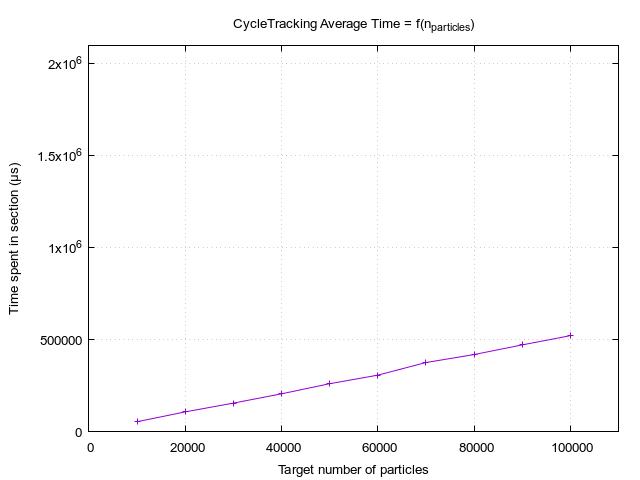

# Fastiron - Rayon-Only Execution

The tallies and timers report can be visualized using column: 

```bash
column -s=';' -t < tallies_report.csv
column -s=';' -t < timers_report.csv
```

The performance recorded for the CTS2 benchmark were obtained using the default 
number of threads determined by [rayon] at run-time.

**Figure of merit**: `2.600e6 [segments / cycle tracking time]`


## Tokei Report

Note that this is prone to change since the implem is currently more of a 
DIY implem than clean code.

```
===============================================================================
 Language            Files        Lines         Code     Comments       Blanks
===============================================================================
 TOML                    1           31           21            3            7
-------------------------------------------------------------------------------
 Markdown                1           37            0           24           13
 |- Shell                1            2            2            0            0
 (Total)                             39            2           24           13
-------------------------------------------------------------------------------
 Rust                   46         7152         5871          424          857
 |- Markdown            39         1176           87          969          120
 (Total)                           8328         5958         1393          977
===============================================================================
 Total                  48         7220         5892          451          877
===============================================================================
```


## Previous Version Comparison

### Percents

Previous version is `1.2-RuSeq`. Current version corresponds to commit `de548f7`.

| Section              | Percent Change |
|----------------------|----------------|
| Total execution time |         -70.5% |
| PopulationControl    |           4.0% |
| CycleTracking        |         -70.7% |
| CycleSync            |           1.9% |

### Implementation

1. Separated `Tallies` from `MonteCarloUnit`. This may be avoidable since reference to tallies 
  are now immutable & they are updated using atomics.
2. Removed cross-section cache-ing from `MonteCarloUnit`. This was done to make the structure 
  read-only.
3. `Balance` structure now uses only `AtomicU64`. This allows us to get rid of unecessary locks
  on thetallies.
4. Scalar flux computations now uses generic atomics from the [`atomic`][1] crate.
5. Mutex are used for extra container and send queue accesses. Those do not seem avoidable, so 
  minimizing lock-time should be the objective.


Some of these changes worsen the sequential performances, most importantly the cache removal.

## Scaling

The parallel iterators were used only in the tracking section, hence the limited
amount of figures.

### Number of threads 


The scaling data was recorded using the `homogeneous7` problem, using progressively
1, 2, 4, 8, 16 threads for Rayon. This should be done again with more threads on 
something else than a laptop.


### Number of particles


Version | `RuSeq` Fastiron | Rayon-only Fastiron
--------|------------------|---------------------
Graphes |  | 
Slope | `18.9e-6 s/particle` | `5.6e-6 s/particle`

**Note**: The slope computation were done using read values from the graphes, they might 
be off by 10-ish %.

[1]: https://docs.rs/atomic/latest/atomic/
[2]: https://docs.rs/rayon/latest/rayon/