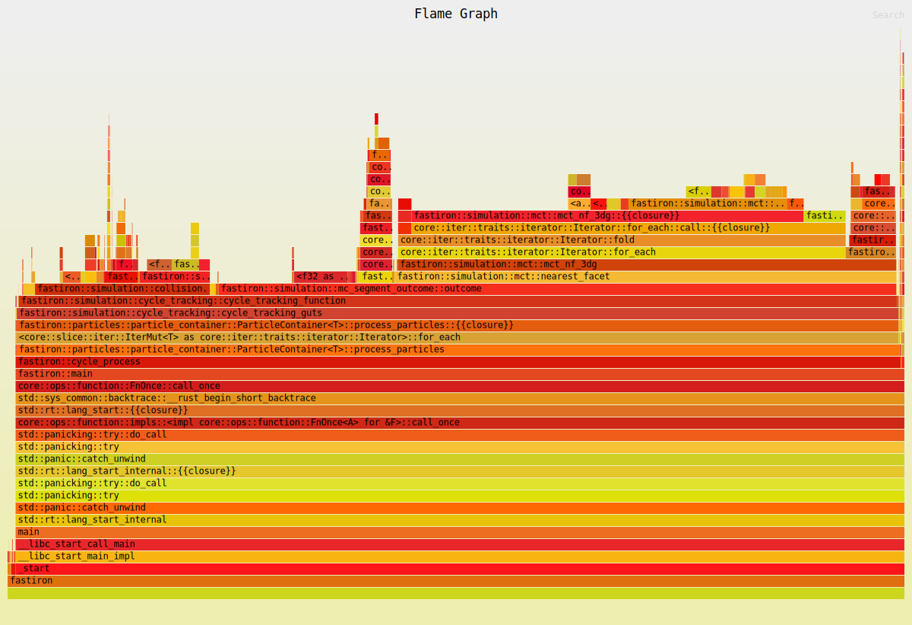
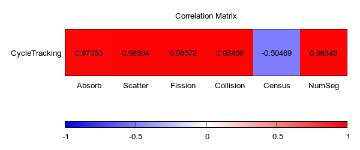
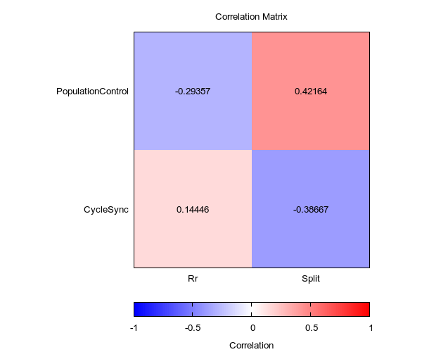
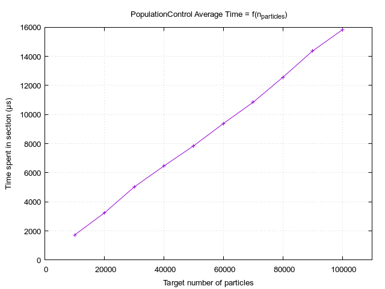
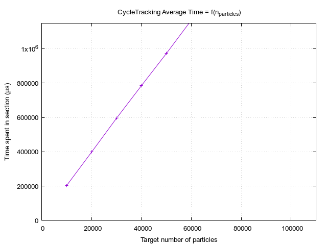
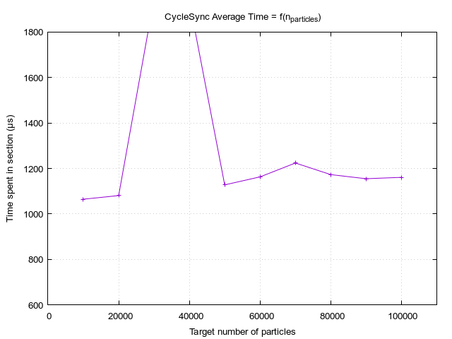

# Behavior of Fastiron

## Flamegraph

## Correlation Study

The goal of this short study is to identify how events influence the time spent in each
section. For this, we can define random variables (RV) using the value taken by tallies 
at each cycle.

The events of interest are the following: 

- `source`, `rr`, `split`: to be linked with `ppControl (s)` and `cycleSync (s)` 
sections.
- `absorb`, `scatter`, `fission`, `collision`, `census`, `escape`: to be linked with 
`cycleTracking (s)` section.

The sample space is the same for all RV: the cycle indexes. The measurable space is
positive integers for event RV, positive reals for section RV. The coefficients might 
be referred to by the name of their variables when it's not ambiguous.

### `CycleTracking`

This figure yields a number of interesting points. First, the `NumSeg` variable is 
not the one with the highest correlation coefficient. This means that while the 
number of computed segment is (heavily) linked to the total time spent in the tracking
section, it is not the most important factor by a large margin.

The `Census` variable has a negative coefficient, meaning that the time spent in the 
tracking section, overall, scales negatively with the number of particle reaching census.
This is coherent as a particle reaching census means that no more segments will be 
computed for it, reducing the "time left to spend" in the tracking section.

Concerning reaction-specific coefficients, the coefficients are overall the same. This 
could indicate that the differences in cost of reaction-specific processing are not 
significant enough overall. This is further supported by the data shown on the 
flamegraph: Approximately 77% of the time spent in `cycle_tracking()` is spent computing
the segment outcome.

### `PopulationControl` & `CycleSync`

- `PopulationControl`/`Rr`: The coefficient is low negative. Note that this value is 
  biased in this benchmark as there is no russian-roulette due to overpopulation, they 
  are only due to the low weight threshold.
- `PopulationControl`/`Split`: The coefficient is positive. We can guess
  that creating particle is a costly task, so the more we create, the more time we 
  spend in the section. The _low-ish_ value could be explained by the number of "task" 
  ran for population control: sourcing, splitting, and two types of russian-roulette.
  The splitting can only account for so much of the total time, hence the 
  low-but-positive coefficient.
- `CycleSync`/`Rr`: The coefficient is low positive. Note that this value is biased 
  in this benchmark as there is no russian-roulette due to overpopulation, they are 
  only due to the low weight threshold.
- `CycleSync`/`Split`: The coefficient is negative. This 
  can be explained by the logic controling the splitting process. Splitting happens 
  after sourcing, which happens after the synchronization phase. Splitting happens if
  the problem is underpopulated, the lower the number of particles, the higher the 
  number of split. A high split number means that, at the end of the last cycle, few
  particles were left. The lower number of particles result in a shorter sync phase. 

## Scaling

Data for the scaling study can be recorded using the `scaling.sh` script. By looking at 
the printed output of the program, one can already see that the figure of merit does not
vary significantly. This means that the time taken to compute a single segment for a particle
-- including look-up & update -- is independent from the total number of particle, which 
is expected. The script used to plot the data is accessible in the `plot` folder in the root 
of the project.

### `PopulationControl` & `CycleTracking`

The time spent in the `PopulationControl` and `CycleTracking` sections seems to scale 
linearly with the target number of particles of the simulation. This is the expected 
results as there are no index lookup or nested iterators in our code; Not that Rust 
would allow it anyway.

### `CycleSync`

The value for 30,000 and 40,000 particles seems to be incorrect. This is probably a fluke and can 
be ignored.

At first, the sync phase seems to be independent from the target number of particles as it stays
constant. However, if we look at the script used to collect the data, we can see that no file 
name was specified for the energy spectrum to be printed. This means that the code is not keeping 
track of the spectrum, hence removing the dependance over the number of particles. If we were to 
run the script again, specifying a file name using `-e`, we would observe a similar figure to that 
of `PopulationControl` and `CycleTracking`.