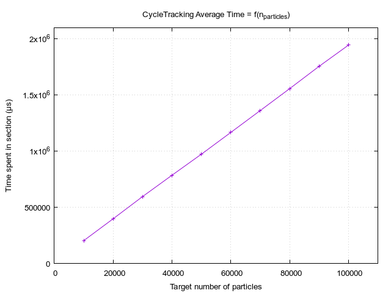

# Comparison between execution on `f32` & `f64`

FoM f64: 7.638e5 [segments / cycle tracking time]
FoM f32: 8.085e5 [segments / cycle tracking time]

## Behaviors

## Scaling
 `f32` Fastiron | `f64` Fastiron
------------------------------------------------------|----------------------------------------------------
   | 
 | 
           | 