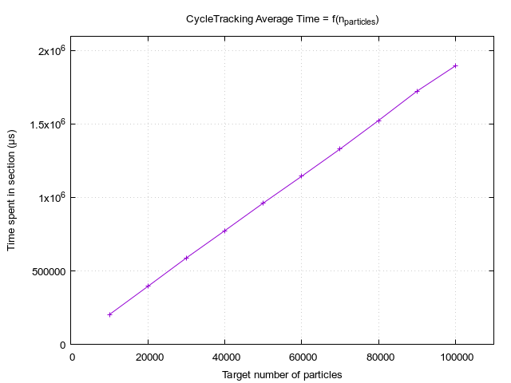

# Comparison between execution on `f32` & `f64`

From Fastiron `1.1` and onward, support for `f32`/`f64` is implemented. This file is updated with the latest 
sequential data on floating-type comparison. The version currently used is `1.2-RuSeq`.

## Behaviors

 `f32` Fastiron                                     | `f64` Fastiron
----------------------------------------------------|----------------------------------------------------
 | 
   | 
 `FoM: 8.085e5 [segments / cycle tracking time]`    | `FoM: 7.638e5 [segments / cycle tracking time]`

There is an approximate 5% difference of Figure of Merit between the two versions. From this we can guess
that the memory one of multiple limiting factors overall. Otherwise, the increase in _FoM_ would have been 
much higher.

Interestingly, event correlation to `CycleTracking` seems exacerbated when using `f64` for computations.
While the difference may not be significant for `Census`, it is for all others. The opposite phenomenon 
is observed for correlations to `CycleSync`. The time spent in the section seems much more dependant of 
the events, especially splitting, when using `f32`.

This can be explained by writing each time variable with two sub-times: **Ttotal = Taffected + Tstatic**.
All events cost a certain time, two parts make it up: A part affected by the floating type used (e.g. arithmetic 
operations) and the rest. This also applies to total section times. \
Depending on the relative importance of Taffected and Tstatic at both timer and event scale, the correlation 
coefficient will evolve differently when swapping **from `f64` to `f32`**:

| Timer Behavior        | Event Behavior        | Effect on time values | Effect on correlation coefficient |
|-----------------------|-----------------------|-----------------------|-----------------------------------|
| Taffected dominant | Taffected dominant | Both go down significantly            | Depends of how much the event time makes up for the total timer value |
| Taffected dominant | Tstatic dominant   | Timer goes down, event stays constant | The event becomes closer to being a bottleneck, coefficient is more or less exacerbated |
| Tstatic dominant   | Tstatic dominant   | Both do not change significantly      | Depends of how much the event time makes up for the total timer value |
| Tstatic dominant   | Taffected dominant | Event goes down, timer stays constant | The event is less likely to be the bottleneck, coefficient is more or less attenuated |

Note that how much an event influence a timer depends of two factors:

- The number of occurence compared to the total number of event of the section
- The time cost of the event compared to time cost of the other event making up the section

## Scaling

 `f32` Fastiron                                       | `f64` Fastiron
------------------------------------------------------|----------------------------------------------------
   | 
 | 
           | 

The `CycleTracking` section does not seem to be affected overall. The scale factor is the same for both 
floating types. The `CycleSync` section scale in the same way, however the overall value is higher for 
`f64` than `f32`.

The `PopulationControl` section scales differently: The graphes show a greater scale factor for the `f64`
run. A quick computation gives the approximate slopes of the `f32` and `f64` graphes (respectively): 
`0.1131` and `0.1566`. 
