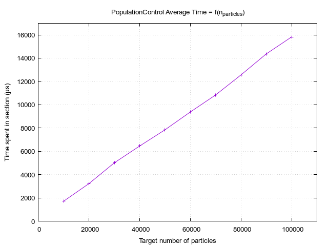
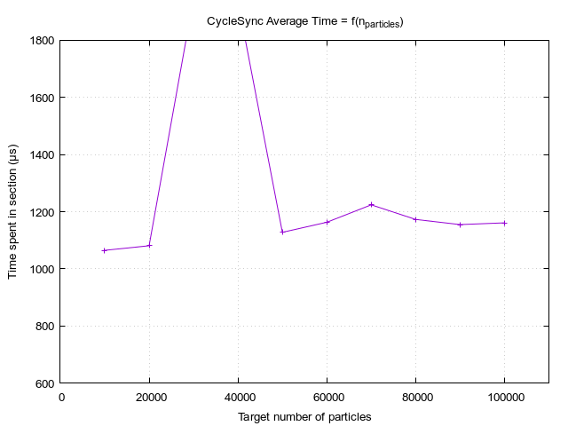

# Comparison between execution on `f32` & `f64`

From Fastiron `1.1` and onward, support for `f32`/`f64` is implemented. This file is updated with the latest 
sequential data on floating-type comparison. The version currently used is `1.2-RuSeq`.

## Behaviors

 `f32` Fastiron                                     | `f64` Fastiron
----------------------------------------------------|----------------------------------------------------
 | 
   | 
 `FoM: 8.085e5 [segments / cycle tracking time]`    | `FoM: 7.638e5 [segments / cycle tracking time]`

There is an approximate 5% difference of Figure of Merit between the two versions. From this we can guess
that the memory bus is **overall** a bottleneck, but is of similar importance to others unidentified; 
Otherwise, the increase in _FoM_ would have been much higher.

Interestingly, event correlation to `CycleTracking` seems exacerbated when using `f64` for computations.
While the difference may not be significant for `Census`, it is for all others.

The opposite phenomenon is observed for correlations to `CycleSync`. The time spent in the section seems
much more dependant of the events, especially splitting, when using `f32`

## Scaling

 `f32` Fastiron                                       | `f64` Fastiron
------------------------------------------------------|----------------------------------------------------
   | 
 | 
           | 