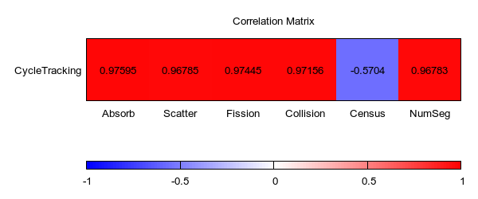
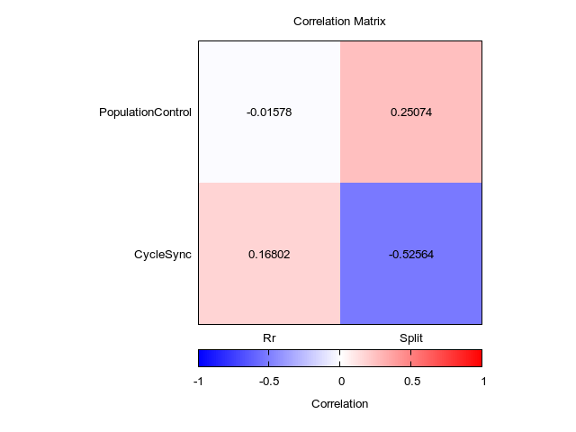
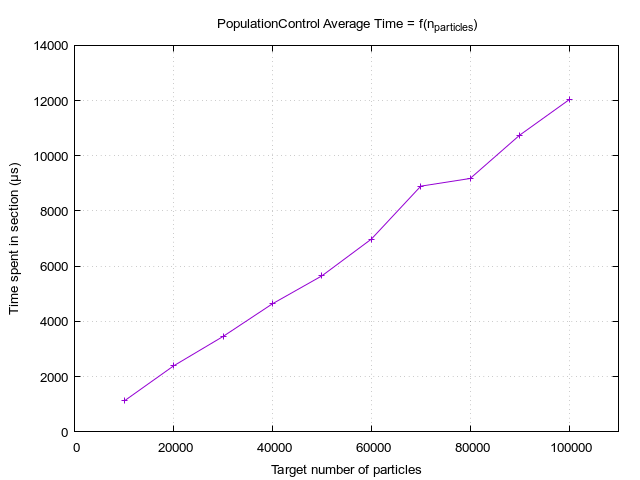
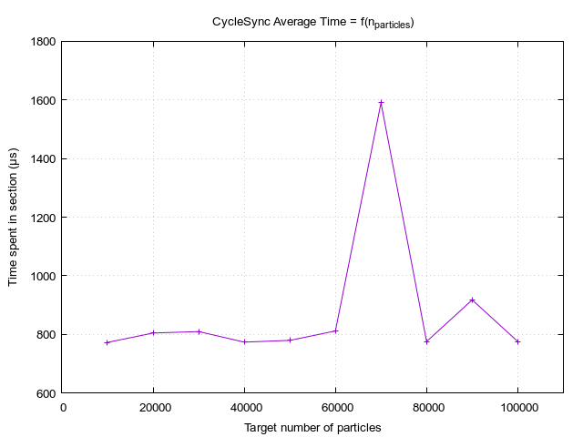

# Sequential Analysis

The study of the influence of the number of particles was done using the `homogeneous7`
problem while the rest was done using the `CTS2_1` benchmark. The data recorded in the 
`csv` files can be viewed using `column`: 

```bash
column -s=';' -t < a_file.csv
```

Note that this analysis precedes some additional changes to be done to the code 
before release. See the comparison [section](#rustified-edition-comparison) for more detail.


## Correlation Study

The goal of this short study is to identify how events influence the time spent in each
section. For this, we can define random variables (RV) using the value taken by tallies 
at each cycle.

The events of interest are the following: 

- `source`, `rr`, `split`: to be linked with `ppControl (s)` and `cycleSync (s)` 
sections.
- `absorb`, `scatter`, `fission`, `collision`, `census`, `escape`: to be linked with 
`cycleTracking (s)` section.

The sample space is the same for all RV: the cycle indexes. The measurable space is
positive integers for event RV, positive reals for section RV.

The data used for this is located in the `CTS2_1_data/` folder, the code used for 
processing and plotting data is located [here][1]. For the analysis, the coefficients
might be referred to by the name of their variables when it's not ambiguous.

### `CycleTracking`



This figure yields a number of interesting points. First, the `NumSeg` variable is 
not the one with the highest correlation coefficient. This means that while the 
number of computed segment is (heavily) linked to the total time spent in the tracking
section, it is not the most important factor.

The `Census` variable has a negative coefficient, meaning that the time spent in the 
tracking section, overall, scales negatively with the number of particle reaching census.
This is coherent as a particle reaching census means that no more segments will be 
computed for it, reducing the "time left to spend" in the tracking section.

From the two previous coefficients, and the one of the `Collision` variable, we can 
speculate that **the distribution of events is more important than the overall number of 
segments**. An additional piece of evidence could be found by tallying facet 
crossing events: the reaction-specific coefficients hint at the cost of this kind of
outcome, `Absorb` being the variable with the highest coefficient. If this hypothesis 
is correct, we would also find a high coefficient for facet crossings.

Concerning reaction-specific coefficients, we can see that the `Absorb` and `Fission`
values are higher than `Scatter`. Considering that absorption happens both in reactions
and at the problem's bounds, it is coherent with the cost of the events. As for fission,
the reaction requires sampling for particles created during the reaction, a costly 
process both in execution time and memory.

### `PopulationControl` & `CycleSync`




- `PopulationControl`/`Rr`: The coefficient is quite close to zero, meaning the time 
  spent doing population control is almost independent from the number of
  russian-rouletted particle. Note that this value is biased in this benchmark as 
  there is no russian-roulette due to overpopulation, they are only due to the low
  weight threshold.
- `PopulationControl`/`Split`: The coefficient is low positive. We can guess
  that creating particle is a costly task, so the more we create, the more time we 
  spend in the section. The low value could be explained by the number of "task" 
  ran for population control: sourcing, splitting, and two types of russian-roulette.
  The splitting can only account for so much of the total time, hence the 
  low-but-positive coefficient.
- `CycleSync`/`Rr`: The coefficient is low positive. Note that this value is biased 
  in this benchmark as there is no russian-roulette due to overpopulation, they are 
  only due to the low weight threshold.
- `CycleSync`/`Split`: The coefficient is negative, with a somewhat high value. This 
  can be explained by the logic controling the splitting process. Splitting happens 
  after sourcing, which happens after the synchronization phase. Splitting happens if
  the problem is underpopulated, the lower the number of particles, the higher the 
  number of split. A high split number means that, at the end of the last cycle, few
  particles were left. The lower number of particles result in a shorter sync phase. 


## Scaling

Data for the scaling study can be recorded using the `scaling.sh` script. By looking at 
the printed output of the program, one can see already that the figure of merit does not
vary significantly. This means that the time taken to compute a segment for a particle
-- including particle look-up & update -- is independent from the total number of particle, 
which is expected.

### `PopulationControl` & `CycleTracking`




The time spent in the `PopulationControl` and `CycleTracking` sections seems to scale 
linearly with the target number of particles of the simulation.

### `CycleSync`



At first, the sync phase seems to be independent from the target number of particles. However,
if we look at the script used to collect the data, we can see that no file name was specified
for the energy spectrum to be printed. This leads to the code not keeping track of the spectrum,
hence removing the dependance over the number of particles. If we were to run the script again,
specifying a file name using `-e`, we would observe a similar figure to that of `PopulationControl`
and `CycleTracking`.


## Rustified Edition Comparison

As a reference, here is the old timer report from the `CTS2_1` benchmark with the figure of merit: 

```
[Timer Report]
Timer Name                       | Total number of calls      Shortest cycle (µs)    Average per cycle (µs)     Longest cycle (µs)    Total in section (µs)    Efficiency rating (%)
Section::Main                    |                     1          3.493894e8                3.493894e8             3.493894e8               3.493894e8                     100.0
Section::CycleInit               |                   100             5.045e3                    5.42e3               1.2292e4                5.42019e5                      44.1
Section::CycleTracking           |                   100          3.289216e6                3.485305e6             4.606365e6             3.48530558e8                      75.7
Section::CycleTrackingKernel     |                  5353          3.284158e6                3.479917e6             4.599556e6             3.47991801e8                      75.7
Section::CycleTrackingComm       |                  5353             5.023e3                   5.375e3                7.352e3                5.37509e5                      73.1
Section::CycleFinalize           |                   100                 0e0                       0e0                    0e0                      3e0                      46.4
Figure of merit: 1.072e6 [segments / cycle tracking time]
```

Here is the current version's timer report, formatted using `column`:  

```
Timer Name                      #calls  Shortest(µs)  Average(µs)   Longest(µs)   Total(µs)     Efficiency(%)
Section::Main                   1       2.99980778e8  2.99980778e8  2.99980778e8  2.99980778e8  100.0
Section::PopulationControl      100     4.459e3       5.24e3        7.914e3       5.2403e5      66.2
Section::CycleTracking          100     2.619447e6    2.990111e6    3.141689e6    2.9901115e8   95.2
Section::CycleTrackingKernel    5353    2.612993e6    2.982677e6    3.133991e6    2.98267726e8  95.2
Section::CycleTrackingComm      5353    6.441e3       7.415e3       8.377e3       7.41538e5     88.5
Section::CycleSync              101     1.044e3       4.411e3       7.449e3       4.41133e5     59.2
Figure of merit: 1.250e6 [segments / cycle tracking time]
```

Here are a few percentages (computed using the [relative change][2] definition): 

- Overall execution time has _decreased_ by **14%**.
- Excluding `Main` and `CycleSync`/`CycleFinalize`, efficiency has _increased_, 
  on average, by **30,7%**. Note that efficiency is defined using an outlier 
  (longest cycle), hence this metric isn't very  significant and could be a fluke.
- The `CycleTracking` section execution time has _decreased_ by **14%**.
- The figure of merit, i.e. the number of segments computed per second, has 
  _increased_ by **16%**.

The timers have been updated to better represent the new structure of the program: The 
`CycleFinalize`/`CycleInit` paradigm has been dropped for a single `CycleSync` section 
to both simplify the code and make it more flexible. They have been defined in order 
to keep some coherence between `PopulationControl` and `CycleInit`, update 
`CycleFinalize` to fit the new structure and leave the `CycleTracking` untouched for 
figure of merit computations.

The population control functions have been integrated in the processing section of the 
program. An interesting observation is that the `CycleInit` and `PopulationControl` 
values have comparable values despite the deletion of the `MCBaseParticle` structure, 
hence a supposedly heavier particle initialization.

Two additional changes will be done before release, hence not be taken into account here:
The usage of [`tinyvec`][3] when sampling for collision and the usage of `Option<usize>`
in `MCFacetAdjacency`. While the first will mostly influence the memory footprint, the 
second might lead to an increase in performances when computing the nearest facet during
tracking.

[1]: https://github.com/imrn99/fi_stats
[2]: https://en.wikipedia.org/wiki/Relative_change_and_difference#Definition
[3]: https://docs.rs/tinyvec/latest/tinyvec/